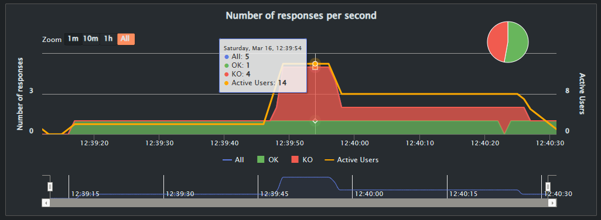
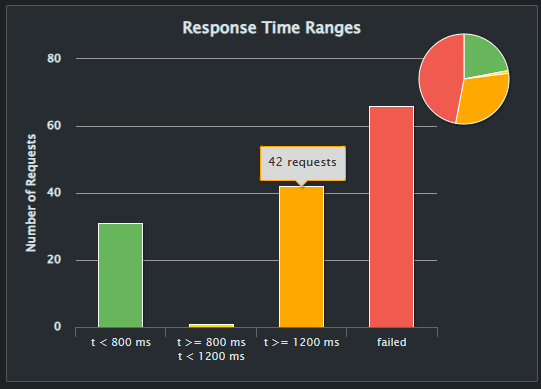

# SportApp - Servicio de Registro de Usuarios - Equipo 13

El propósito de este experimento es probar de la arquitectura diseñada para el servicio de registro de usuarios favoreciendo la seguridad, deteccion de ataque, respuesta del ataque desfavoreciendo el tiempo de respuesta, cohesión, Testeabilidad(Complejas). Se espera que en caso de que el servicio de registro de usuarios falle se activa un servicio de respaldo para el registro de usuarios, para esto se utiliza las herramientas: Docker, NGINX, JWT, RabbitMQ, Flask, python, Gatling y SQLite.

Este experimento esta relacionado con la [HU013](https://github.com/users/AfLosada/projects/1/views/1?pane=issue&itemId=56667221), para este caso validaremos sobre el punto de sensibilidad la seguridad del servicio de registro de usuarios que tiene un alto grado de insertidumbre, para esto utilizaremos un estilo de arquitectura de microservicios.

Se utilizan las tacticas de Arquitectura:

* Autenticador : Autentica al usario que va a consumir el servicio de registro de usuario y consulta de usuario, denegando el servicio en caso de que el secret key no sea correcto.

* CQRS : Separación de responsabilidades. La idea es tener diferentes servicios para consultas y para comandos. En este caso los comandos van al servicio de registro de usuarios y las consultas al servicio de consulta de usuarios.

* Redundancia Pasiva con Resincronización de Estado : Recuperación. Cuando se detecte un fallo en el registro de usuarios se creará una nueva instancia del microservicio de registro de usuarios que se encargará de recibir los llamados mientras se reinicia el servicio principal.

* Encolamiento de solicitudes : Pone las solicitudes en una cola o buffer antes de ser procesadas por la base de datos. Esta cola actúa como un amortiguador que permite manejar las solicitudes de manera más eficiente, evitando la sobrecarga del sistema y garantizando un procesamiento ordenado y controlado de las solicitudes.

* Rate Limit : Una configuracion en el API GETWAY que permite limitar y denegar el servicio si se supera un numero de solicitudes por segundo, de modo que se pueda responder automaticamente ante un ataque. 

Listado de componentes (Microservicios).
| Microservicio | Proposito y comportamiento esperado | Tecnología Asociada |
|-|-|-|
| Registro de Usuarios | Maneja los comandos relacionados a la entidad de usuarios, en este caso su registro | Flask |
| Consulta de Usuarios | Maneja las consultas relacionadas a la entidad de usuarios. | Flask |
| Cola de Mensajería​ | Recibir las solicitudes del usuario y ser consumido por el servicio de registro de usuarios.​ | RabbitMQ |
| API Gateway | Maneja la interacción con usuarios, enruta las conexiones al servicio que le corresponda. | NGINX |
| Base de Datos | Guarda los registros de usuarios y permite consultarlos. | SQLite |
| Autenticador | Crear un secretkey para ser consultado por el usuario y ser validado por el servicio de registro de usuarios.​ | Flask |

# Arquitectura de despliegue:


## Instalación

Como primera medida para la instalacion se debe contar con la instalacion completa de Docker para la cual pueden seguir esta guias: [Windows](https://docs.docker.com/desktop/install/windows-install/), [Mac](https://docs.docker.com/desktop/install/mac-install/) o [Linux](https://docs.docker.com/desktop/install/linux-install/).

Despues de tener instalado docker se debe clonar este repositorio a su ambiente local utilizando:

```
git clone https://github.com/AfLosada/ArquitecturasAgiles-G13
```


Para correr la aplicación se debe ejecutar el siguiente comando dentro de la ubicacion del repositorio en la carpeta experimento-2:


```
docker-compose up
```

O si prefiere correr la aplicación en background se debe ejecutar el siguiente comando:

```
docker-compose up -d
```

Con estos pasos realizamos la instalacion y ejecucion de los microservicios de la arquitectura diseñada para el registro de usuarios.


## Descripción de los servicios

Esta rama (main) muestra la comunicación entre servicios de manera síncrona e implementa el patrón CQRS. Para la comunicación síncrona se utiliza los microservicios.

El experimento implementa tres servicios:

#### Servicio de registro de usuarios

Al implemetar el patrón CQRS las operaciones que expone este servicio se implementa el servicio de la solicitud de registro de usuarios (registro_usuario/app.py)., el cual manda una peticion al servicio de consulta para validar si se puede o no registrar el usuario, y la peticion a la base de datos para persistir el usuario.

* register: este servicio lleva la solicitud de confirmacion y la solicitud de registro de usuario. 

- consulta de usuario: Esta operación se implementa en un request. a través del método post.

- Registro de usuario: Esta operación se implementa en un request. a través del método post.
  
- Cola de mensajeria: Esta operacion se implementa en un request. a traves del metodo get para el servicio de consulta de usuario y un metood post para el servicio de registro de usuario.

Se puede observar que una vez creada la orden se coloca en la cola el id de la orden para que esta sea procesada.
 
```python
@app.route('/user-commands/users/register', methods=['POST'])
def register():
  data = request.get_json()
  
  if 'correo' not in data or 'clave' not in data:
    return jsonify({'error': 'Datos invalidos'}), 400

  correo = data['correo']
  clave = data['clave']

  token = request.headers.get('Authorization')
  result = requests.get(CERTIFICADOR_SERVICE_URL, headers={'Authorization': token}).json()

  if 'error' in result:
    return jsonify({'error': 'No se puede registrar usuario. TOKEN NO VALIDO'}), 400
  
  result = register_user(correo, clave)
  return result
  

if __name__ == '__main__':
    app.run(debug=True, host='0.0.0.0', port=5002)
```

Este contiene una cola de mensajeria actúa como un amortiguador que permite manejar las solicitudes de manera más eficiente.
```python
app = Celery('tasks', broker='pyamqp://guest@localhost//')
DB_SERVICE_URL = 'http://db_usuario:5004/user'

@app.task
def register_user(correo, clave):
  datos = {"correo": correo, "clave": clave}
  result = requests.post(DB_SERVICE_URL, json=datos).json()
  return result
```
#### Servicio de consulta de usuarios

Al implemetar el patrón CQRS las operaciones que expone este servicio se implementan: las consultas (consulta_usuario/app.py). En este archivo se tienen las siguientes operaciones:

- check_user: Esta operación se implementa en la función de consultas de usuario a través del método post, para poder optener la data de la base de datos y poder compararlo si el usuario puede ser registrado devolviendo un "can_register": TRUE o si no puede ser registrado devolviendo un "can_register": FALSE.

```python
@app.route('/user-queries/users/check/<string:user_correo>', methods=['GET'])
@jwt_required()
def check(user_correo):
  if not user_correo:
    return jsonify({'error': 'Datos invalidos'}), 400

  result = check_user(user_correo)
  if not result:
    return jsonify({'error': 'Usuario no encontrado'}), 404
  else:
    return jsonify(result), 200

if __name__ == '__main__':
    app.run(debug=True, host='0.0.0.0', port=5003)
```

Este contiene una cola de mensajeria actúa como un amortiguador que permite manejar las solicitudes de manera más eficiente.

```python
app = Celery('tasks', broker='pyamqp://guest@localhost//')
DB_SERVICE_URL = 'http://db_usuario:5004/users?correo='

@app.task
def check_user(user_correo):
  url = f'{DB_SERVICE_URL}{user_correo}'
  result = requests.get(url).json()
  return result
```

#### Base de datos

Al implemetar el patrón CQRS las operaciones que expone este servicio se implementan en dos partes: comandos (register) y consultas (users). para esto se utilizan los metodos:

- users: Esta operación se implementa para obtener los usuarios a través del método get.
- register: Esta operación se implementa persistir los nuevos usuarios a través del método post.

```python
def create_flask_app():
    app = Flask(__name__)
    app.config['SQLALCHEMY_DATABASE_URI'] = 'sqlite:///users.db'
    app.config['SQLALCHEMY_TRACK_MODIFICATIONS'] = False

    app_context = app.app_context()
    app_context.push()
    add_urls(app)
    CORS(app, origins = '*')
    return app

def add_urls(app):
    api = Api(app)
    api.add_resource(VistaUsuario, '/user', '/user/<int:user_id>')
    api.add_resource(VistaUsuarios, '/users')

if __name__ == '__main__':
    app = create_flask_app()
    db.init_app(app)
    db.create_all()
    app.run(debug=True, host='0.0.0.0', port=5004)
```

#### API Gateway

En este experimento se utiliza la configuración proxy del servidor Ngnix para implementar el componente API Gateway. Esta configuración permite que todas las solicitudes se hagan al servidor Ngnix y este redireccione al servicio correspondiente de acuerdo a la operación y ruta especificada en el url, por ejemplo http://localhost/user-commands/users:
Adicional se implementa un Rate Limit que limite el numero de solicitudes por segundo y el burst de solictudes para resistir y reaccionar ante un ataque.

```
# Configuracion de Nginx para el rate limit en el servicio de registro de usuarios
limit_req_zone $binary_remote_addr zone=registro_usuario_limit:10m rate=1r/s;

# Mapa para determinar si se aplica el rate limit o se demora la respuesta
map $limit_req_status $delay_duration {
    429     30s;
    default 0s;
}

# Configuración del servidor
server {
    listen 5000;

    # Configuración para el servicio de registro de usuarios
    location /user-commands/users {
        # Aplicar el rate limit a esta ubicación
        limit_req zone=registro_usuario_limit burst=5;

        # Determinar si se debe aplicar un retraso
        if ($limit_req_status = 429) {
            set $delay "${delay_duration}";
        }

        proxy_pass http://registro_usuario:5002;
        proxy_set_header X-Real-IP $remote_addr;
        proxy_set_header X-Forwarded-For $proxy_add_x_forwarded_for;
        proxy_set_header Host $host;

    }

    # Configuración para el servicio de consultas de usuarios
    location /user-queries/users {
        proxy_pass http://consulta_usuario:5003;
        proxy_set_header X-Real-IP $remote_addr;
        proxy_set_header X-Forwarded-For $proxy_add_x_forwarded_for;
        proxy_set_header Host $host;
    }

    # Configuración para la base de datos de usuarios
    location /users {
        proxy_pass http://db_usuario:5004;
        proxy_set_header X-Real-IP $remote_addr;
        proxy_set_header X-Forwarded-For $proxy_add_x_forwarded_for;
        proxy_set_header Host $host;
    }
}
```

Dentro del API Gateway se implementa el sistam de monitor para validar el estado del microservicio de registro de usuarios.

## Autenticador

Este tiene la funcion de dar y validar un secret key constantemente  autenticando al usuario que solicita el servicio de registro de usuario, si el secret key no es el adecuado este bloquea el acceso al servicio, realizando el aseguramiento del servicio.


```#!/bin/bash
import datetime
import jwt
from flask import Flask, jsonify, request

app = Flask(__name__)
app.config['JWT_SECRET_KEY'] = 'grupo_17_secret_key'

@app.route('/token', methods=['POST'])
def generar_token():
    fecha_hora_actual = datetime.datetime.utcnow()
    expiracion = fecha_hora_actual + datetime.timedelta(hours=5)
    token = jwt.encode({'exp': expiracion}, key='grupo_17_secret_key', algorithm='HS256')
    return jsonify({'token': token}), 200

@app.route('/token', methods=['GET'])
def verificar_token():
    token = request.headers.get('Authorization')
    if not token:
        return jsonify({'error': 'Token no proporcionado'}), 401
    try:
        payload = jwt.decode(token, key='grupo_17_secret_key', algorithms=['HS256'])
        expiracion = datetime.datetime.utcfromtimestamp(payload['exp'])
        diferencia_tiempo = expiracion - datetime.datetime.utcnow()
        if diferencia_tiempo.total_seconds() / 3600 < 5:
            return jsonify({'valido': True}), 200
        else:
            return jsonify({'error': 'Token expirado'}), 401
    except jwt.ExpiredSignatureError:
        return jsonify({'error': 'Token expirado'}), 401
    except jwt.InvalidTokenError:
        return jsonify({'error': 'Token inválido'}), 401

if __name__ == '__main__':
    app.run(debug=True, host='0.0.0.0', port=5001)

```


# Pruebas

Para la validacion de la hipotesis de la arquitectura de microservicios para el registro de usuarios se implementan pruebas de estres en la herramienta de pruebas Gatling, validando el servicio de registro de usuarios, la deteccion de la falla por nuestro monitor y la respuesta ante la falla.

Para la instalacion y ejecucion del ambiente de pruebas se debe realizar desde una consola bash por ejemplo git bash, ubicarse en la carpeta /experimento-1/gatling y ejecutar el comando.


```bash
./load.sh
```
Esto correrá las pruebas de carga de Gatling que están en la carpeta `load-simulator`. Los resultados de las pruebas se guardarán en el archivo test-results. Para que las pruebas sean exitosas es necesario que la aplicación esté corriendo.
En caso de presentar error: 


se debe entrar al archivo load.sh y modificarlo segun salga en tu git bash:


En el archivo [CargaUsuarios.scala](experimento-1\gatling\load-simulator\src\test\scala\usuariosConcurrentes\CargaUsuarios.scala) se encuentran los detalles de las pruebas. Hay urls y escenarios con diferentes tipos de carga.

Los nombres de los usuarios se obtienen de un feed que añade números del 1 al 1000.

Actualmente el escenario base es:

Si se quieren customizar las pruebas seguir la documentación de Gatling: [documentación](https://docs.gatling.io/reference/script/core/injection/). Con esto se puede cambiar el archivo .scala.

**1000 usuarios concurrentes** + **inserción de fallas de manera aleatoria**

# Metricas y Resultados de la arquitectura

## Resultados Experimento 2

El rate-limiting de nginx fue configurado de manera exitosa y limitó la cantidad de requests que se pueden hacer de manera concurrente a un mismo enpoint.





El contenedor de nginx detecta cuando se exceden las solicitudes


### Se hizo una prueba con las siguientes características:​

- Se solicita un token para poder hacer registros de usuario​
- Se hace 1 registro por segundo durante 20 segundos​
- Se hacen 5 registros por segundo durante 10 segundos​
- Se hacen 2 registros por segundo durante 20 segundos​
### Resultados 
[Presentacion del experimiento-2 AAS-H810.pdf](https://github.com/AfLosada/ArquitecturasAgiles-G13/files/14624749/AAS-H810.pdf)
 
- ​Durante los primeros 20 segundos se obtienen respuestas válidas​
- Durante los siguientes 10 segundos los registros son bloqueados​
- Durante los siguientes 20 segundos algunos registros son bloqueados por el tema del rate limiting. ​

[url resultados](https://pruebas-gatling-seguridad.vercel.app/req_post-usuario-va-1086779557.html)

[video](https://www.youtube.com/watch?v=DzZ3WkSZBEE)

### Conclusion

La arquitectura presentada cumple con el requerimiento pues:

1. El autenticador requiere que las peticiones que se hagan vengan con un token válido
2. El rate-limiting del nginx es capaz de limitar las peticiones cuando recibe bastantes.
