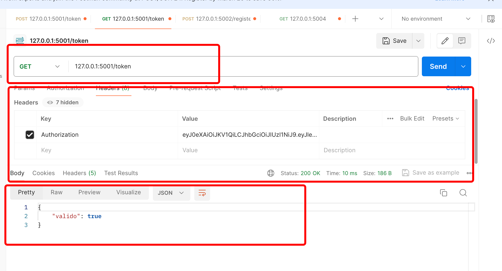

## Generación y Verificación de Tokens

### Generar Token (POST)
La URL `127.0.0.1:5001/token` a través del método POST genera un token con una expiración de 5 horas.

### Verificar Token (GET)
La URL `127.0.0.1:5001/token` a través del método GET espera que el header de la solicitud contenga el parámetro "Authorization" con el valor del token generado en el paso anterior. La estructura de la solicitud debería ser similar a esta:

Las respuestas posibles de este endpoint son:

- `200 OK`: Indica que el token es válido.
- `401 Unauthorized`: Indica que el token ha expirado o es inválido.
